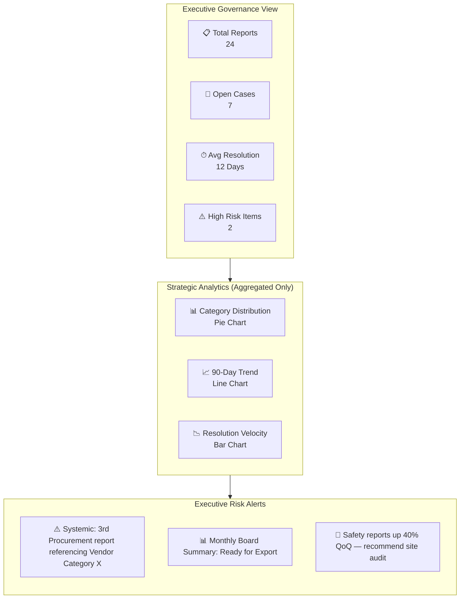

**Whistleblowing Web Application Research Report**
*For a KSA Real Estate Company | Self-Hosted, Anonymous Ethics Reporting*

---

## 1. Executive Summary

The KSA real estate sector operates under increasing governance scrutiny aligned with Saudi Vision 2030, anti-corruption frameworks, and corporate transparency mandates. A self-hosted whistleblowing platform addresses a critical gap: most market solutions are SaaS-based (violating data sovereignty and external-sharing constraints), while open-source alternatives are either journalistic-grade overkill or mobile-first products ill-suited for internal audit teams working on laptops.

**Recommended Approach:** Build a lightweight, containerized web application with three isolated layers:
1. **Public Submission Layer:** True zero-tracking anonymous reporting with file upload.
2. **Investigation Layer:** Internal Audit case-management dashboard with end-to-end encryption.
3. **Governance Layer:** CEO dashboard exposing only aggregated, anonymized intelligence to prevent re-identification risks.

**Strategic Pillars:**
- **Trust through Transparency:** The UI must *prove* anonymity, not merely claim it.
- **Laptop-Optimized Density:** Multi-pane dashboards with dense tables, persistent sidebars, and keyboard-navigable workflows.
- **KSA Localization:** Arabic RTL support, Hijri date compatibility, and real-estate-specific categories (procurement fraud, tenant rights, site safety, financial misconduct, regulatory violations).

---

## 2. Benchmark Analysis of Small-Scale Solutions

| Solution | Type | Self-Hosted | Best For | Gaps Relative to Requirements |
|---|---|---|---|---|
| **GlobaLeaks** | Open Source | Yes | NGOs / Media | Tor-centric, mobile-first UI, complex admin overhead, over-engineered for a single-company internal use case. |
| **SecureDrop** | Open Source | Yes | Journalists | Extreme security (air-gapped workflows), requires dedicated Linux admin, no built-in multi-role dashboard separation. |
| **Navex/EthicsPoint** | Commercial SaaS | No | Enterprise | Violates "no external data sharing" and self-hosted mandate; data leaves KSA jurisdiction. |
| **Vault Platform** | Commercial SaaS | No | Mid-Market | Strong UX but cloud-dependent; no on-premise deployment for KSA data residency. |
| **Custom Build** | Bespoke | Yes | This Use Case | Only way to satisfy the unique intersection of: laptop-optimized UI, strict KSA hosting, CEO/IA role separation, and 5-category real estate alignment. |

**Conclusion:** The market lacks a lightweight, self-hosted, corporate-internal whistleblower application. A custom build using established security *patterns* (drawn from GlobaLeaks/SecureDrop) but with a simplified, laptop-dense UI is the optimal path.

---

## 3. Trust-Building UI/UX Recommendations

Anonymous reporting suffers from the "trust paradox": users must believe a system is anonymous without technical proof. The UI must compensate through behavioral and visual design.

### A. Zero-Tracking Manifesto (Visible Proof)
- **Persistent Trust Bar:** Fixed header stating *"No IP Logging • No Cookies • No Analytics • No Third-Party Assets."* Include a visual shield indicator that turns green on load.
- **External Asset Ban:** No Google Fonts, no CDN scripts, no analytics. All CSS/JS served from the same origin. The browser's DevTools console should show zero external network requests.
- **Isolated Subdomain:** Host on `secure.ethics.[company].com` with no navigation links back to the corporate marketing site. This prevents accidental identity leakage via referrer headers or shared sessions.

### B. Progressive Disclosure Wizard
Do not present a massive form. Use 3 steps:
1. **Category** (5 large, icon-driven buttons).
2. **Narrative** (single textarea + optional date/location).
3. **Evidence** (drag-and-drop zone with explicit metadata-stripping promise).

### C. Anti-Fingerprinting Measures
- **No JavaScript Frameworks:** Use vanilla JS to avoid framework-based telemetry. Minimize JS footprint.
- **No Required PII:** Do not require name, email, department, or employee ID. If "department" is needed for routing, use a dropdown with broad categories, not precise org-chart names.
- **File Upload Transparency:** Display a warning: *"EXIF location data and author metadata will be automatically stripped from all images and PDFs before storage."*

### D. Post-Submission Trust Loop
- **Receipt Code:** Display a 16-character code (e.g., `KSA-7F9A-2B4C-1D8E`). This enables two-way anonymous dialogue without accounts.
- **Expectation Setting:** Tell the user exactly when the report will be reviewed (e.g., *"Internal Audit reviews new reports within 48 hours. Save this code to check for questions."*).

### E. Arabic / KSA Localization
- Full RTL layout with Arabic as the default language; English toggle available.
- Hijri date picker for incident dates.
- Categories localized for KSA real estate context:
  1. **Procurement & Contract Fraud** (kickbacks, bid rigging)
  2. **Tenant & Customer Rights** (harassment, unfair eviction, discrimination)
  3. **Workplace Safety & Labor** (site hazards, Iqama/sponsorship abuse)
  4. **Financial Misconduct** (embezzlement, expense fraud, asset theft)
  5. **Regulatory & Land Compliance** (title fraud, zoning violations, AML concerns)

---

## 4. Dashboard Layout Recommendations

### Design Philosophy: Laptop-First, Dense Data
- **Persistent Sidebar Navigation:** No hamburger menus. Left sidebar always visible for rapid module switching.
- **Multi-Pane Layouts:** Use master-detail views (queue on left, case detail on right) rather than mobile-style stacked cards.
- **Keyboard Shortcuts:** `J/K` for next/previous case, `R` for resolve, `E` for escalate.
- **Dark Mode Default:** Reduces screen glare in open office environments and signals "secure" aesthetic.

### Internal Audit Dashboard
**Purpose:** Triage, investigate, and resolve. This role sees raw report content and evidence.

**Layout Zones:**
- **Queue Panel (Left 40%):** Filterable table with columns: `Receipt ID | Category | Priority | Age | Status`. Color-coded rows (red > 7 days old).
- **Detail Panel (Right 60%):**
  - Decrypted report content (decrypted client-side in browser via private key).
  - Evidence list with sandboxed preview (images rendered as flattened PNG, PDFs rendered via isolated iframe).
  - **Audit Trail:** Immutable log of who opened the case, downloaded files, or changed status.
  - **Internal Notes:** Free-text field (logged and attributed to auditor).
  - **Action Bar:** Status transitions (`New → Under Review → Investigating → Resolved/Closed`), ability to post an anonymous question to the reporter (via receipt code), and escalation checkbox to notify CEO of systemic risk.

### CEO Dashboard
**Purpose:** Governance oversight and cultural health monitoring. **Critical constraint:** The CEO must *never* see raw report text or granular details that could allow re-identification of the reporter via context (project names, dates, specific amounts).

**Layout Zones:**
- **KPI Ribbon (Top):** Four cards: Total Reports (90-day), Open Cases, Average Resolution Time, High-Priority Count.
- **Strategic Charts (Middle):**
  - **Category Distribution:** Donut chart showing volume per 5 categories.
  - **Trend Line:** Reports received vs. resolved over time.
  - **Heatmap:** Days of week / times of month when reports spike (indicates payroll or procurement cycle issues).
- **Risk Alerts (Bottom Right):** Systemic flags generated by IA (e.g., *"3rd Procurement report this quarter referencing Vendor X"*). These are written by IA in sanitized, summary form.
- **Export Zone:** PDF summary for board reporting (aggregated data only).

---

## 5. Security Best Practices for Anonymous Systems

### The Anonymity / Rate-Limiting Paradox
The requirement specifies *both* "no tracking" and "5/hour per IP." Storing IPs for rate limiting violates anonymity. **Resolution:**
- **Reverse-Proxy Rate Limiting:** Use **nginx `limit_req`** with an in-memory zone. The application layer never receives or stores the IP. Logs must be written to `/dev/null` for this vhost.
- **Alternative:** Implement a client-side Proof-of-Work (Hashcash-style) puzzle before submission to prevent spam without any IP tracking.

### Data Architecture
- **Client-Side Encryption (Zero-Knowledge Server):** The submission page encrypts report text and file names using the Internal Audit public key (OpenPGP.js) *before* transmission. The server stores only ciphertext. If the server is compromised, reports remain unreadable.
- **File Sanitization Pipeline:**
  1. Upload to quarantine directory (no execute permissions).
  2. Strip EXIF/metadata via `ExifTool` and flatten images to PNG.
  3. Scan with ClamAV.
  4. Store with randomized filenames (`uuid.ext`) outside webroot; serve via secure proxy only to authenticated auditors.
- **Database:** PostgreSQL with application-level encryption for any residual metadata (timestamps, categories). No user accounts table linked to reports.

### Access & Infrastructure
- **Self-Hosted Stack:** Docker Compose or Kubernetes on KSA infrastructure (STC Cloud, on-premise data center). No external API calls.
- **Network Segmentation:** Dashboard accessible only via corporate VPN or on-site VLAN. Submission page is the only internet-facing port (443).
- **Dashboard Authentication:** MFA (TOTP) mandatory for all IA and CEO accounts. Session timeout after 15 minutes of inactivity.
- **Audit Logging:** All dashboard actions (login, case view, file download, status change) are logged to a separate, append-only syslog server. This log is *not* anonymous—it tracks admin accountability to protect against insider abuse.
- **Secure Deletion:** Auto-purge closed reports and files after 90 days (configurable). Shred files with `shred` or encrypted volume deletion.

---

## 6. Feature Recommendations (Prioritized)

### Must Have (MVP — Launch Critical)
1. **Anonymous Submission Wizard** with 5 KSA real-estate categories and vanilla-JS client-side encryption.
2. **Secure File Upload** (Images, PDFs) with automatic EXIF/metadata stripping and 10MB limit.
3. **Rate Limiting** via nginx (in-memory, no persistent IP storage).
4. **Internal Audit Dashboard** with case queue, status workflow, and encrypted evidence handling.
5. **CEO Dashboard** with aggregated KPIs and trend charts only (no raw report access).
6. **Bilingual Arabic/English RTL Support.**
7. **Self-Hosted Docker Deployment** with zero external dependencies.
8. **Anonymous Receipt Code System** for post-submission status checking.

### Should Have (Phase 2 — 3 Months Post-Launch)
9. **Two-Way Anonymous Messaging:** Auditor posts questions; reporter answers using receipt code.
10. **Internal Email Alerts:** SMTP relay to IA team (via internal Exchange/Zimbra, no external SaaS) for new report notifications.
11. **File Quarantine & AV Scanning** pipeline before decryption key access.
12. **CEO Report Export:** Sanitized PDF board summary auto-generated monthly.
13. **Data Retention Auto-Deletion** with configurable policies.

### Could Have (Phase 3 — Strategic Enhancement)
14. **Tor / .onion Mirror:** For maximum anonymity (relevant if investigating senior leadership).
15. **Severity Auto-Scoring:** Keyword-based risk flagging in IA dashboard (e.g., "bribe," "safety death," "CEO").
16. **Blockchain Timestamping:** Prove report existence at a given date without revealing content.
17. **Voice Memo Upload:** With server-side transcription and immediate audio deletion.

---

## 7. High-Level Mermaid Wireframes

### A. Anonymous Submission Page
```mermaid
graph TB
    subgraph HeaderZone[" "]
        H1[🔒 Anonymous Ethics Portal<br/>Zero Tracking • No Cookies • No IP Logs • KSA Real Estate Corp]
    end

    subgraph FormZone[" "]
        direction TB
        S1[Step 1: Select Category<br/>┌─────────────┐ ┌─────────────┐<br/>│ Procurement │ │   Safety    │<br/>└─────────────┘ └─────────────┘<br/>┌─────────────┐ ┌─────────────┐<br/>│Tenant Rights│ │  Financial  │<br/>└─────────────┘ └─────────────┘<br/>┌─────────────┐<br/>│ Harassment  │<br/>└─────────────┘]
        S2[Step 2: Incident Details<br/>Describe what happened:<br/>[__________________________________________]]
        S3[Step 3: Attach Evidence<br/>📎 Drag & Drop PDF, JPG, PNG<br/>⚠️ EXIF metadata will be automatically stripped]
        S4[Optional: Incident Date / Location<br/>[__________] [__________]]
    end

    subgraph ActionZone[" "]
        A1[[ 🛡️ Submit Report Securely ]]
        A2[You will receive a unique Receipt Code on the next screen.<br/>Save it to check for updates or reply anonymously.]
    end

    HeaderZone --> FormZone
    FormZone --> ActionZone
```

### B. Internal Audit Dashboard
```mermaid
graph TB
    subgraph Sidebar["Audit Console"]
        direction TB
        NAV1[📥 New Reports (3)]
        NAV2[🔍 Under Review]
        NAV3[✅ Resolved]
        NAV4[⚙️ Settings & Keys]
    end

    subgraph MainPanel["Case Management Workspace"]
        direction TB
        M1[Filters: Category ▼ | Priority ▼ | Date Range ▼ | Status ▼]
        M2[┌────────┬─────────────┬──────────┬──────────┬─────────┐<br/>│ Case ID│ Category    │ Received │ Priority │ Status  │<br/>├────────┼─────────────┼──────────┼──────────┼─────────┤<br/>│ #1042  │ Procurement │ 14/03/44 │ High     │ New     │<br/>│ #1041  │ Safety      │ 13/03/44 │ Medium   │ Review  │<br/>└────────┴─────────────┴──────────┴──────────┴─────────┘]
        M3[Active Case Detail<br/>┌──────────────────────────────────────────┐<br/>│ Receipt: KSA-7F9A-2B4C-1D8E              │<br/>│ Content: [Decrypted Text View]             │<br/>│ Evidence: 📄 doc.pdf  📷 photo.png         │<br/>│ Internal Notes: [____________________]   │<br/>│ Audit Log: Ahmed viewed files 10:14 AM   │<br/>│ Actions: [Status ▼] [Ask Question] [Close]│<br/>└──────────────────────────────────────────┘]
    end

    Sidebar --- MainPanel
```

### C. CEO Dashboard


---

**Next Steps for Implementation:**
1. **Architecture Review:** Select KSA hosting environment and generate OpenPGP keypair for client-side encryption.
2. **UI Prototyping:** Build the anonymous submission page first; it is the highest-risk trust surface and should be user-tested with employees for Arabic RTL comprehension.
3. **Policy Alignment:** Draft the data retention and CEO-view sanitization policy *before* writing dashboard queries to prevent accidental PII/identity exposure in aggregates.